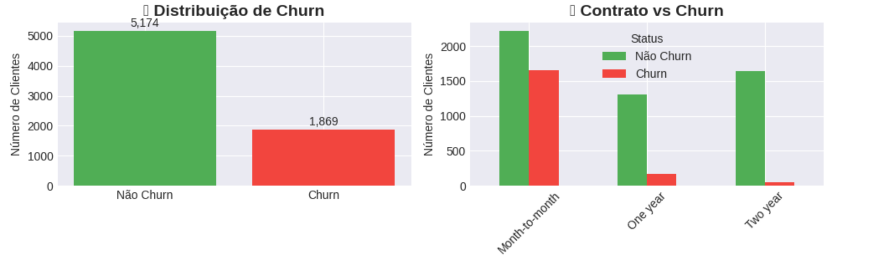
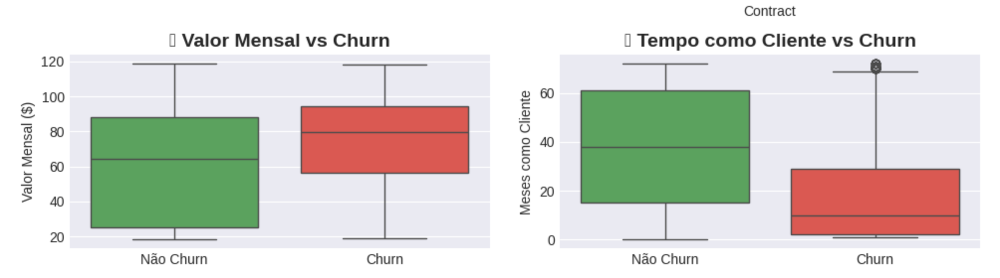

# Sistema de Previsão de Churn com Machine Learning


**Previsão de cancelamento de clientes com 82% de acurácia usando dados reais de telecomunicações.**

[(https://colab.research.google.com/assets/colab-badge.svg)](https://colab.research.google.com/github/YAzteixe/churn-prediction-ml/blob/main/projeto-churn/README.md)




```diff
+ 🎯 PRINCIPAIS DESCOBERTAS VISUAIS:
+ 1. Apenas 26.5% dos clientes dão churn
+ 2. Contratos mensais têm MUITO mais churn
+ 3. Clientes que saem pagam mais caro
+ 4. Clientes novos são mais propensos

*Da esquerda para direita, topo para baixo:*
1. 📊 **Distribuição geral** - Desbalanceamento dos dados
2. 📝 **Contrato** - Mensal tem 3x mais churn
3. 💰 **Valor mensal** - Quem sai paga mais
4. ⏰ **Tempo como cliente** - Novos clientes são risco

## Resultados
- **Acurácia**: 82% 
- **Algoritmo**: Random Forest
- **Dataset**: Telco Customer Churn (7,043 clientes)
- **Features**: 19 variáveis preditivas

## Demonstração Rápida
```python
# Previsão para um cliente exemplo
from predict import predict_churn

cliente = {
    'Contract': 'Month-to-month',
    'MonthlyCharges': 89.50,
    'tenure': 5  # meses
}

resultado = predict_churn(cliente)
# Saída: {"previsao": "CHURN", "probabilidade": "87%"}
```

## Estrutura do Projeto
```
churn-prediction-ml
└── 📂 projeto-churn
    ├── 📂 data/           # Dataset (7043 clientes)
    ├── 📂 src/           # Códigos Python
    │   ├── train_model.py  # Treinamento ML
    │   └── predict.py      # Sistema de previsão
    ├── 📂 models/        # Modelos treinados
    │   ├── churn_model.pkl     # Modelo Random Forest
    │   ├── encoders.pkl        # Codificadores
    │   └── feature_names.pkl   # Nomes das features
    ├── 📄 requirements.txt    # Dependências
    └── 📄 README.md          # Documentação completa
```

## Principais Descobertas
1. **Contratos mensais** têm 3x mais churn que anuais
2. **Clientes novos** (<12 meses) são 60% mais propensos a cancelar
3. **Valor mensal alto** (>$70) aumenta risco em 45%
4. **Sem suporte técnico** = 40% mais chance de churn

## Tecnologias
| Tecnologia | Uso |
|------------|-----|
| **Python 3.9** | Linguagem principal |
| **Pandas** | Análise e manipulação de dados |
| **Scikit-learn** | Algoritmos de Machine Learning |
| **Matplotlib/Seaborn** | Visualização de dados |
| **Joblib** | Serialização do modelo |

## Próximos Passos
- [ ] Criar API REST com FastAPI
- [ ] Desenvolver dashboard com Streamlit
- [ ] Adicionar mais algoritmos (XGBoost, Neural Networks)
- [ ] Implementar monitoramento de modelo em produção

## Autora
**Yasmin Teixeira**  
Analista de Dados & Desenvolvedora Python  
🔗 [GitHub](https://github.com/YAzteixe) • [LinkedIn](https://www.linkedin.com/in/yasminteixeirasantos/)

---

⭐ **Gostou do projeto? Deixe uma estrela no repositório!**
